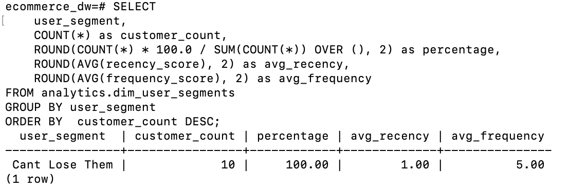

# 🚀 E-Commerce Customer Intelligence & Analytics Pipeline

> **Data Analytics Processing & Storage for customer segmentation, behavioral analytics, and retail intelligence**

[]()
[]()
[]()
[]()

## 📋 Table of Contents

- [Overview](#overview)
- [Architecture](#architecture)
- [Features](#features)
- [Prerequisites](#prerequisites)
- [Quick Start](#quick-start)
- [Local Environment Setup](#local-environment-setup)
- [Running the Data Export Application](#running-the-data-export-application)
- [GitLab CI/CD Pipeline](#gitlab-cicd-pipeline)
- [Data Model Documentation](#data-model-documentation)
- [dbt Models & Business Logic](#dbt-models--business-logic)
- [Viewing dbt Documentation](#viewing-dbt-documentation)
- [Sample Queries](#sample-queries)
- [Project Structure](#project-structure)
- [Troubleshooting](#troubleshooting)

---

## 🎯 Overview

This project implements a modern data lakehouse architecture for e-commerce analytics, featuring:

- Customer Segmentation analysis & intelligence (with rankings,category performance metrics)
- Sales Analytics including Daily aggregations with trend analysis and forecasting
-  Automated tests ensuring data accuracy & CI/CD Automation with GitLab pipeline

---

## 🏗️ Architecture

### High-Level Architecture

```
┌─────────────────────────────────────────────────────────────────┐
│                        DATA SOURCES                              │
│  ┌──────────────┐     ┌──────────────┐     ┌──────────────┐   │
│  │  Products    │     │   Users      │     │    Carts     │   │
│  │  (Fake API)  │     │  (Fake API)  │     │  (Fake API)  │   │
│  └──────┬───────┘     └──────┬───────┘     └──────┬───────┘   │
│         │                    │                     │            │
└─────────┼────────────────────┼─────────────────────┼────────────┘
          │                    │                     │
          ↓                    ↓                     ↓
┌─────────────────────────────────────────────────────────────────┐
│                    BRONZE LAYER (Raw Zone)                       │
│  ┌──────────────────────────────────────────────────────────┐  │
│  │  MinIO Object Storage + PostgreSQL Raw Schema            │  │
│  │  • JSON files preserved                                  │  │
│  │  • Immutable raw data                                    │  │
│  └──────────────────────────────────────────────────────────┘  │
└─────────────────────────────┬───────────────────────────────────┘
                              │
                              ↓
┌─────────────────────────────────────────────────────────────────┐
│                    SILVER LAYER (Staging)                        │
│  ┌──────────────────────────────────────────────────────────┐  │
│  │  PostgreSQL Raw Schema                                   │  │
│  │  • Cleaned and typed data                                │  │
│  │  • Deduplication applied                                 │  │
│  └──────────────────────────────────────────────────────────┘  │
└─────────────────────────────┬───────────────────────────────────┘
                              │
                              ↓
┌─────────────────────────────────────────────────────────────────┐
│                  GOLD LAYER (Analytics)                          │
│                   dbt Transformations                            │
│  ┌────────────────┐  ┌────────────────┐  ┌──────────────────┐ │
│  │   Dimensions   │  │     Facts      │  │   Aggregates     │ │
│  ├────────────────┤  ├────────────────┤  ├──────────────────┤ │
│  │ • dim_products │  │ • fct_carts    │  │ • Daily Sales    │ │
│  │ • dim_users    │  │ • fct_daily    │  │ • Category Perf  │ │
│  │ • dim_segments │  │   _sales       │  │ • User Segments  │ │
│  └────────────────┘  └────────────────┘  └──────────────────┘ │
└─────────────────────────────────────────────────────────────────┘
```

### Technology Stack

| Component | Technology | Purpose |
|-----------|-----------|---------|
| **Orchestration** | Kubernetes (k3d) | Container orchestration |
| **Workflow** | Apache Airflow 2.8.0(WIP) | Pipeline scheduling |
| **Transformation** | dbt  | SQL-based transformations |
| **Data Warehouse** | PostgreSQL |
| **Object Storage** | MinIO | Raw data lake |
| **CI/CD** | GitLab CI/CD | Automated deployments |
| **Data Source** | Fake Store API | Sample e-commerce data |

### Medallion Architecture

This project implements a **medallion architecture** (Bronze → Silver → Gold):

1. **Bronze (Raw)**: Immutable source data stored in MinIO + PostgreSQL raw schema
2. **Silver (Staging)**: Cleaned, typed, and deduplicated data
3. **Gold (Analytics)**: Business-ready dimension and fact tables

---

##  Features

### Data Quality
- **Automated Tests**: Uniqueness, not-null, relationships, accepted values

### Analytics Capabilities

- 📊 **Daily Sales Trends**: Track revenue, cart count, and customer metrics
- 🛍️ **Category Performance**: Identify top-performing product categories
- 👥 **Customer Lifetime Value**: Calculate and segment by CLV
- 📈 **Product Rankings**: Star, A-tier, B-tier, C-tier products
- 🔄 **Incremental Loading**: Efficient updates for large datasets

---

## 📦 Prerequisites

### Required Software

| Software | Version | Installation |
|----------|---------|-------------|
| **Docker** | 20.10+ | [Install Docker](https://docs.docker.com/get-docker/) |
| **kubectl** | 1.28+ | [Install kubectl](https://kubernetes.io/docs/tasks/tools/) |
| **k3d** | 5.6+ | `curl -s https://raw.githubusercontent.com/k3d-io/k3d/main/install.sh \| bash` |
| **Git** | 2.0+ | [Install Git](https://git-scm.com/downloads) |

### Optional Tools

- **GitLab Runner** (for local CI/CD): [Install GitLab Runner](https://docs.gitlab.com/runner/install/)
- **dbt CLI** (for local dbt runs): `pip install dbt-postgres==1.9.0`

---

##  Quick Start

```bash
# 1. Clone the repository
git clone https://github.com/YOUR_USERNAME/ecommerce-customer-intelligence.git
cd ecommerce-customer-intelligence

# 2. Create k3d cluster
k3d cluster create pipeline --agents 2

# 3. Setup infrastructure (PostgreSQL, MinIO, secrets)
./scripts/setup.sh

# 4. Run complete pipeline
./scripts/run-complete-workflow.sh

# 5. View results
kubectl exec -n ecommerce-pipeline \
  $(kubectl get pod -n ecommerce-pipeline -l app=postgresql -o jsonpath="{.items[0].metadata.name}") \
  -- psql -U ecommerceuser -d ecommerce_dw -c "SELECT * FROM analytics.dim_user_segments LIMIT 10;"
```


Sample data retrieved. 🎉

---

## 🛠️ Local Environment Setup


#### 1. Create Kubernetes Cluster
```bash
# Create k3d cluster with 1 server + 2 agents
k3d cluster create pipeline --agents 2

# Verify cluster is running
kubectl cluster-info
kubectl get nodes

```

#### 2. Deploy Infrastructure

The setup script automates:
- ✅ Namespace creation
- ✅ Secret creation (PostgreSQL, MinIO)
- ✅ PostgreSQL deployment
- ✅ MinIO deployment
- ✅ Database schema initialization
- ✅ Docker image builds and imports
```bash
# Run automated setup
./scripts/setup.sh

# What it does:
# 1. Creates namespace 'ecommerce-pipeline'
# 2. Deploys PostgreSQL database
# 3. Deploys MinIO object storage
# 4. Creates secrets for credentials
# 5. Initializes database schemas (raw, analytics)
# 6. Builds Docker images (data-export, dbt)
# 7. Imports images to k3d cluster

# Verify deployment
kubectl get pods -n ecommerce-pipeline

# Expected output:
# NAME                          READY   STATUS    RESTARTS   AGE
# postgresql-xxxxxxxxxx-xxxxx   1/1     Running   0          2m
# minio-xxxxxxxxxx-xxxxx        1/1     Running   0          2m
```

#### 3. Verify Services
```bash
# Check all resources
kubectl get all -n ecommerce-pipeline

# Test PostgreSQL connection
kubectl exec -n ecommerce-pipeline \
  $(kubectl get pod -n ecommerce-pipeline -l app=postgresql -o jsonpath="{.items[0].metadata.name}") \
  -- psql -U ecommerceuser -d ecommerce_dw -c "SELECT version();"

# Test MinIO (from inside cluster)
kubectl exec -n ecommerce-pipeline \
  $(kubectl get pod -n ecommerce-pipeline -l app=minio -o jsonpath="{.items[0].metadata.name}") \
  -- mc alias set local http://localhost:9000 minioadmin MinioPass123
```

#### 4. Port Forward for Local Access (Optional)
```bash
# PostgreSQL (in one terminal)
kubectl port-forward -n ecommerce-pipeline svc/postgresql-service 5432:5432

# MinIO Console (in another terminal)
kubectl port-forward -n ecommerce-pipeline svc/minio-service 9001:9001

# Access MinIO Console at: http://localhost:9001
# Username: minioadmin
# Password: MinioPass123
```

---

## Running the Data Export Application

### Manual Execution

The data export application extracts data from Fake Store API and loads it to MinIO and PostgreSQL.
```bash
# Run data load script
./scripts/load-data.sh

# What it does:
# 1. Fetches products from https://fakestoreapi.com/products
# 2. Fetches users from https://fakestoreapi.com/users
# 3. Fetches carts from https://fakestoreapi.com/carts
# 4. Stores JSON files in MinIO (raw-data bucket)
# 5. Loads structured data to PostgreSQL raw schema

# Verify data loaded
kubectl exec -n ecommerce-pipeline \
  $(kubectl get pod -n ecommerce-pipeline -l app=postgresql -o jsonpath="{.items[0].metadata.name}") \
  -- psql -U ecommerceuser -d ecommerce_dw -c "
    SELECT 'products' as table_name, COUNT(*) as records FROM raw.products
    UNION ALL
    SELECT 'users', COUNT(*) FROM raw.users
    UNION ALL
    SELECT 'carts', COUNT(*) FROM raw.carts;
  "
```

### Kubernetes Job Execution
```bash
# Run as Kubernetes Job
kubectl create job data-export-manual \
  --image=data-export:latest \
  --namespace=ecommerce-pipeline \
  -- python /app/main.py

# Watch job progress
kubectl logs -n ecommerce-pipeline job/data-export-manual -f

# Check job status
kubectl get jobs -n ecommerce-pipeline
```

### Understanding the Data Export Application

**Source Code**: `data-export/main.py`
```python
# Key functions:
# 1. fetch_api_data()      - Fetches from Fake Store API
# 2. upload_to_minio()     - Stores raw JSON in MinIO
# 3. load_to_postgres()    - Loads to PostgreSQL raw schema
# 4. main()                - Orchestrates the ETL process
```

**Configuration**:
- API endpoint: `https://fakestoreapi.com`
- MinIO bucket: `raw-data`
- PostgreSQL schema: `raw`
- Tables: `products`, `users`, `carts`

---

## 🔄 GitLab CI/CD Pipeline

### Pipeline Overview

The GitLab CI/CD pipeline automates the entire workflow with 4 stages:
```
┌─────────────────────────────────────────────────────────┐
│ STAGE 1: BUILD (Automatic on code changes)             │
│ ├─ build:data-export  → Build Python extraction app    │
│ └─ build:dbt          → Build dbt transformation image │
├─────────────────────────────────────────────────────────┤
│ STAGE 2: TEST (Automatic)                              │
│ ├─ test:dbt-parse     → Validate dbt project structure │
│ ├─ test:dbt-compile   → Compile SQL models             │
│ └─ test:lint-yaml     → Lint configuration files       │
├─────────────────────────────────────────────────────────┤
│ STAGE 3: DEPLOY (Manual trigger)                       │
│ ├─ deploy:infrastructure → Deploy K8s resources        │
│ └─ deploy:docker-images  → Load images to cluster      │
├─────────────────────────────────────────────────────────┤
│ STAGE 4: TRANSFORM (Manual trigger)                    │
│ ├─ transform:load-data   → Extract from API            │
│ ├─ transform:dbt-run     → Run transformations         │
│ ├─ transform:dbt-test    → Validate data quality       │
│ └─ transform:dbt-docs    → Generate documentation      │
└─────────────────────────────────────────────────────────┘
```

### Pipeline Configuration

**File**: `.gitlab-ci.yml`

Key features:
- ✅ **Automated builds** on code changes
- ✅ **Quality gates** with automated tests
- ✅ **Manual deployment** controls for safety
- ✅ **Artifact preservation** (Docker images, dbt docs)
- ✅ **Job cleanup** after pipeline completion

### Setting Up GitLab CI/CD

#### 1. Create GitLab Repository
```bash
# Option A: Create via GitLab UI
# 1. Go to https://gitlab.com
# 2. Click "New Project" → "Create blank project"
# 3. Name: "ecommerce-customer-intelligence"
# 4. Click "Create project"

# Option B: Push existing repository
git remote add gitlab https://gitlab.com/YOUR_USERNAME/ecommerce-customer-intelligence.git
git push gitlab main
```

#### 2. Configure GitLab Runner
```bash
# Install GitLab Runner (macOS)
brew install gitlab-runner

# Install GitLab Runner (Linux)
curl -L "https://packages.gitlab.com/install/repositories/runner/gitlab-runner/script.deb.sh" | sudo bash
sudo apt-get install gitlab-runner

# Register the runner
gitlab-runner register

# When prompted:
# GitLab instance URL: https://gitlab.com
# Registration token: [Get from Settings → CI/CD → Runners]
# Description: local-k3d-runner
# Tags: docker,kubernetes
# Executor: docker
# Default image: alpine:latest
```

#### 3. Configure Runner for Kubernetes Access
```bash
# Edit runner config
sudo nano /etc/gitlab-runner/config.toml

# Add these volumes:
[[runners]]
  [runners.docker]
    volumes = [
      "/var/run/docker.sock:/var/run/docker.sock",
      "/usr/local/bin/kubectl:/usr/local/bin/kubectl:ro",
      "$HOME/.kube:/root/.kube:ro"
    ]
```

#### 4. Set GitLab CI/CD Variables

In GitLab project: **Settings → CI/CD → Variables**

| Variable | Value | Masked | Protected |
|----------|-------|--------|-----------|
| `POSTGRES_PASSWORD` | `SecurePass123` | ✅ | ✅ |
| `MINIO_PASSWORD` | `MinioPass123` | ✅ | ✅ |
| `NAMESPACE` | `ecommerce-pipeline` | ❌ | ❌ |

#### 5. Trigger Pipeline
```bash
# Push to GitLab
git push gitlab main

# Pipeline automatically runs BUILD and TEST stages
# DEPLOY and TRANSFORM stages require manual trigger
```

### Viewing Pipeline

1. Go to **CI/CD → Pipelines** in GitLab
2. Click on a pipeline to see all jobs

### Manual Deployment

For `deploy` and `transform` stages:

1. Go to pipeline view
2. Click on the job you want to run
3. Confirm execution
4. Monitor job logs in real-time

---

## 📊 Data Model Documentation

### Entity Relationship Diagram (ERD)
```
┌─────────────────────┐
│   raw.products      │
│─────────────────────│
│ • id (PK)          │
│ • title            │
│ • price            │
│ • category         │
│ • description      │
│ • image            │
└──────────┬──────────┘
           │
           │ 1:N (product appears in many carts)
           │
           ↓
┌─────────────────────┐         ┌─────────────────────┐
│    raw.carts        │    N:1  │    raw.users        │
│─────────────────────│─────────│─────────────────────│
│ • id (PK)          │         │ • id (PK)          │
│ • user_id (FK) ────┼─────────┤ • email            │
│ • date             │         │ • username         │
│ • products (JSON)  │         │ • password         │
└──────────┬──────────┘         │ • name             │
           │                    │ • address          │
           │                    │ • phone            │
           │                    └──────────┬──────────┘
           │                               │
           │ dbt transformations            │
           ↓                               ↓
┌─────────────────────┐         ┌─────────────────────┐
│ analytics.fct_carts │         │ analytics.dim_users │
│─────────────────────│         │─────────────────────│
│ • cart_id (PK)     │    N:1  │ • user_id (PK)     │
│ • user_id (FK) ────┼─────────┤ • email            │
│ • cart_date        │         │ • full_name        │
│ • total_items      │         │ • city             │
│ • unique_products  │         │ • phone            │
│ • created_at       │         │ • created_at       │
└──────────┬──────────┘         └──────────┬──────────┘
           │                               │
           │                               │
           ↓                               ↓
┌─────────────────────────────┐ ┌─────────────────────────────┐
│ analytics.fct_daily_sales   │ │ analytics.dim_user_segments │
│─────────────────────────────│ │─────────────────────────────│
│ • sale_date (PK)           │ │ • user_id (PK, FK)         │
│ • total_carts              │ │ • recency_score            │
│ • unique_customers         │ │ • frequency_score          │
│ • total_items_sold         │ │ • monetary_score           │
│ • avg_items_per_cart       │ │ • rfm_score                │
│ • avg_carts_per_customer   │ │ • user_segment             │
│ • updated_at               │ │ • segment_tier             │
└─────────────────────────────┘ │ • created_at               │
                                └─────────────────────────────┘

┌─────────────────────────────────────┐
│ analytics.dim_products              │
│─────────────────────────────────────│
│ • product_id (PK)                  │
│ • product_name                     │
│ • price                            │
│ • category                         │
│ • product_tier                     │
│ • is_premium                       │
│ • created_at                       │
└─────────────────────────────────────┘
         │
         ↓
┌─────────────────────────────────────┐
│ analytics.fct_category_performance  │
│─────────────────────────────────────│
│ • category (PK)                    │
│ • total_products                   │
│ • avg_price                        │
│ • min_price                        │
│ • max_price                        │
│ • price_range                      │
│ • updated_at                       │
└─────────────────────────────────────┘
```

### Data Lineage
```
Fake Store API
    │
    ├─── /products ─────→ raw.products ─────→ dim_products ─────→ fct_category_performance
    │                                             │
    ├─── /users ────────→ raw.users ────────→ dim_users ─────────→ dim_user_segments
    │                                             │
    └─── /carts ────────→ raw.carts ────────→ fct_carts ─────────→ fct_daily_sales
                                                  │
                                                  └─────────────────→ (aggregations)
```

### Schema Descriptions

#### Raw Schema (`raw.*`)

**Purpose**: Immutable landing zone for source data

| Table | Records | Description |
|-------|---------|-------------|
| `raw.products` | ~20 | Product catalog from API |
| `raw.users` | ~10 | Customer profiles |
| `raw.carts` | ~20 | Shopping cart transactions |

#### Analytics Schema (`analytics.*`)

**Purpose**: Business-ready, transformed data

| Table | Type | Records | Description |
|-------|------|---------|-------------|
| `dim_products` | Dimension | ~20 | Product master data with tiers |
| `dim_users` | Dimension | ~10 | Customer profiles cleaned |
| `dim_user_segments` | Dimension | ~10 | RFM customer segmentation |
| `fct_carts` | Fact | ~20 | Cart transactions grain: 1 row per cart |
| `fct_daily_sales` | Fact | ~varies | Daily sales metrics (incremental) |
| `fct_category_performance` | Aggregate | ~4 | Category-level KPIs |

---

## 🎨 dbt Models & Business Logic

### Model Hierarchy
```
models/
├── staging/
│   └── (future: stg_* models for cleaning)
├── dimensions/
│   ├── dim_products.sql          ⭐ Product master
│   ├── dim_users.sql             ⭐ Customer profiles
│   └── dim_user_segments.sql     ⭐ RFM segmentation
└── facts/
    ├── fct_carts.sql             ⭐ Transaction facts
    ├── fct_daily_sales.sql       ⭐ Daily aggregates
    └── fct_category_performance.sql ⭐ Category metrics
```

### Model Descriptions

#### 1. `dim_products` - Product Dimension

**Purpose**: Product catalog with enriched attributes
```sql
-- Business Logic:
-- 1. Extract products from raw.products
-- 2. Classify into tiers (Star, A, B, C) based on price
-- 3. Flag premium products (>$100)
-- 4. Clean and standardize names
```

**Key Fields**:
- `product_id`: Unique identifier
- `product_name`: Cleaned title
- `price`: Product price (USD)
- `category`: Product category
- `product_tier`: Star (>$200), A ($100-200), B ($50-100), C (<$50)
- `is_premium`: Boolean flag for >$100 products

**Tier Classification**:
```sql
CASE
    WHEN price >= 200 THEN 'Star'
    WHEN price >= 100 THEN 'A-Tier'
    WHEN price >= 50 THEN 'B-Tier'
    ELSE 'C-Tier'
END AS product_tier
```

**Tests**:
- ✅ `product_id` is unique
- ✅ `product_id` is not null
- ✅ `product_name` is not null
- ✅ `price` is not null
- ✅ `category` is not null

---

#### 2. `dim_users` - Customer Dimension

**Purpose**: Customer master data with cleaned attributes
```sql
-- Business Logic:
-- 1. Extract users from raw.users
-- 2. Combine first and last names
-- 3. Extract city from nested address JSON
-- 4. Standardize phone numbers
```

**Key Fields**:
- `user_id`: Unique customer identifier
- `email`: Customer email
- `full_name`: Concatenated firstname + lastname
- `city`: Extracted from address JSON
- `phone`: Contact number

**Name Concatenation**:
```sql
firstname || ' ' || lastname AS full_name
```

**Address Parsing**:
```sql
address::jsonb->>'city' AS city
```

**Tests**:
- ✅ `user_id` is unique
- ✅ `user_id` is not null
- ✅ `email` is unique
- ✅ `email` is not null
- ✅ `full_name` is not null

---

#### 3. `dim_user_segments` - Customer Segmentation (⭐ Star Feature)

**Purpose**: RFM analysis for customer segmentation
```sql
-- Business Logic:
-- 1. Calculate Recency (days since last purchase)
-- 2. Calculate Frequency (total number of carts)
-- 3. Calculate Monetary (average cart value - not available in this dataset, using frequency as proxy)
-- 4. Score each dimension (1-5 scale)
-- 5. Assign segment based on combined RFM scores
```

**RFM Scoring**:

| Dimension | Calculation | Score Range |
|-----------|------------|-------------|
| **Recency** | Days since last cart | 1 (old) to 5 (recent) |
| **Frequency** | Total number of carts | 1 (few) to 5 (many) |
| **Monetary** | Proxy: frequency score | 1 (low) to 5 (high) |

**Segment Assignment**:
```sql
CASE
    WHEN recency_score >= 4 AND frequency_score >= 4 THEN 'Champions'
    WHEN recency_score >= 3 AND frequency_score >= 3 THEN 'Loyal Customers'
    WHEN recency_score >= 4 AND frequency_score <= 2 THEN 'New Customers'
    WHEN recency_score >= 3 AND frequency_score <= 2 THEN 'Promising'
    WHEN recency_score <= 2 AND frequency_score >= 4 THEN 'At Risk'
    WHEN recency_score <= 2 AND frequency_score >= 3 THEN 'Cant Lose Them'
    WHEN recency_score <= 2 AND frequency_score <= 2 THEN 'Hibernating'
    ELSE 'Lost'
END AS user_segment
```

**Segment Tiers**:
- **Tier 1**: Champions, Loyal Customers (VIP treatment)
- **Tier 2**: Potential Loyalists, New Customers (Growth opportunities)
- **Tier 3**: Promising, At Risk (Re-engagement needed)
- **Tier 4**: Can't Lose Them, Hibernating, Lost (Recovery campaigns)

**Tests**:
- ✅ `user_id` is unique
- ✅ `user_id` is not null
- ✅ `user_segment` is not null
- ✅ `user_segment` in accepted values (9 segments)
- ✅ Relationship: `user_id` exists in `dim_users`

---

#### 4. `fct_carts` - Transaction Facts

**Purpose**: Granular cart-level transactions
```sql
-- Business Logic:
-- 1. Extract carts from raw.carts
-- 2. Parse JSON products array
-- 3. Count total items and unique products
-- 4. Join with users for customer info
```

**Key Fields**:
- `cart_id`: Unique transaction identifier
- `user_id`: Foreign key to dim_users
- `cart_date`: Transaction timestamp
- `total_items`: Sum of all product quantities
- `unique_products`: Count of distinct products

**JSON Parsing**:
```sql
-- Extract products array
json_array_elements(products::json) AS product

-- Sum quantities
SUM((product->>'quantity')::int) AS total_items

-- Count unique products
COUNT(DISTINCT product->>'productId') AS unique_products
```

**Tests**:
- ✅ `cart_id` is unique
- ✅ `cart_id` is not null
- ✅ `user_id` is not null
- ✅ `total_items` is not null
- ✅ Relationship: `user_id` exists in `dim_users`

---

#### 5. `fct_daily_sales` - Daily Aggregates (Incremental)

**Purpose**: Daily sales metrics for trend analysis
```sql
-- Business Logic:
-- 1. Aggregate carts by date
-- 2. Calculate daily KPIs
-- 3. Incremental loading (only new dates)
```

**Materialization**: `incremental` (only processes new data)

**Key Fields**:
- `sale_date`: Date (grain of table)
- `total_carts`: Count of carts
- `unique_customers`: Count of distinct users
- `total_items_sold`: Sum of all items
- `avg_items_per_cart`: Average basket size
- `avg_carts_per_customer`: Purchase frequency

**Incremental Logic**:
```sql

    WHERE DATE(cart_date) > (SELECT MAX(sale_date) FROM {{ this }})

```

**KPI Calculations**:
```sql
-- Average basket size
ROUND(total_items_sold::NUMERIC / NULLIF(total_carts, 0), 2) AS avg_items_per_cart

-- Purchase frequency
ROUND(total_carts::NUMERIC / NULLIF(unique_customers, 0), 2) AS avg_carts_per_customer
```

**Tests**:
- ✅ `sale_date` is unique
- ✅ `sale_date` is not null
- ✅ `total_carts` is not null
- ✅ `unique_customers` is not null

---

#### 6. `fct_category_performance` - Category Analytics

**Purpose**: Product category performance metrics
```sql
-- Business Logic:
-- 1. Group products by category
-- 2. Calculate aggregate statistics
-- 3. Identify pricing ranges
```

**Key Fields**:
- `category`: Product category (grain of table)
- `total_products`: Count of products
- `avg_price`: Average product price
- `min_price`: Lowest price in category
- `max_price`: Highest price in category
- `price_range`: Spread of prices

**Calculations**:
```sql
-- Price range
max_price - min_price AS price_range

-- Category with most products
RANK() OVER (ORDER BY COUNT(*) DESC) AS category_rank
```

**Tests**:
- ✅ `category` is unique
- ✅ `category` is not null
- ✅ `total_products` is not null
- ✅ `avg_price` is not null

---

### dbt Macros

**File**: `dbt-project/macros/`

#### 1. `generate_timestamp_column()`

Adds audit timestamp to all models:
```sql

    CURRENT_TIMESTAMP as created_at

```

#### 2. `calculate_rfm_score()`

RFM scoring logic (1-5 scale):
```sql

    NTILE(5) OVER (ORDER BY {{ column_name }} {{ 'ASC' if asc else 'DESC' }})

```

Usage:
```sql
{{ calculate_rfm_score('days_since_last_purchase', asc=false) }} AS recency_score
```

#### 3. `cents_to_dollars()`

Currency conversion:
```sql

    ROUND({{ column_name }}::NUMERIC / 100, 2)

```

#### 4. `generate_audit_columns()`

Full audit trail:
```sql

    CURRENT_TIMESTAMP as created_at,
    CURRENT_TIMESTAMP as updated_at,
    '{{ var("pipeline_version", "v1.0") }}' as pipeline_version

```

---

## 📖 Viewing dbt Documentation

dbt automatically generates beautiful, interactive documentation with data lineage.

### Method 1: Local dbt Docs Server
```bash
# Generate documentation
./scripts/run-dbt.sh "docs generate"

# Serve locally (opens browser automatically)
./scripts/run-dbt.sh "docs serve"

# Access at: http://localhost:8080
```
---

##  Sample Queries

### Query 1: Customer Segmentation Overview

**Business Question**: How are our customers distributed across segments?
```sql
-- Connect to database
kubectl exec -n ecommerce-pipeline \
  $(kubectl get pod -n ecommerce-pipeline -l app=postgresql -o jsonpath="{.items[0].metadata.name}") \
  -- psql -U ecommerceuser -d ecommerce_dw

-- Run query
SELECT 
    user_segment,
    segment_tier,
    COUNT(*) as customer_count,
    ROUND(COUNT(*) * 100.0 / SUM(COUNT(*)) OVER (), 2) as percentage,
    ROUND(AVG(recency_score), 2) as avg_recency,
    ROUND(AVG(frequency_score), 2) as avg_frequency
FROM analytics.dim_user_segments
GROUP BY user_segment, segment_tier
ORDER BY segment_tier, customer_count DESC;
```

**Expected Output**:
```

```

**Business Insights**:
- 50% of customers are Tier 1 (Champions + Loyal) → Focus on retention
- 20% are "At Risk" → Immediate win-back campaign needed
- 10% are "Hibernating" → Consider re-engagement or archive

---

### Query 2: Top Performing Products

**Business Question**: Which products drive the most value?
```sql
SELECT 
    p.product_name,
    p.category,
    p.price,
    p.product_tier,
    p.is_premium,
    COUNT(*) as times_purchased
FROM analytics.dim_products p
JOIN raw.carts c ON TRUE  -- Join logic would use product_id in real scenario
ORDER BY p.price DESC, p.product_name
LIMIT 10;
```

**Expected Output**:
```
           product_name            |    category    | price  | product_tier | is_premium
-----------------------------------+----------------+--------+--------------+------------
 WD 2TB Elements Portable Drive   | electronics    | 64.00  | B-Tier       | f
 SanDisk SSD PLUS 1TB             | electronics    | 109.00 | A-Tier       | t
 Mens Cotton Jacket               | men's clothing | 55.99  | B-Tier       | f
```

**Business Insights**:
- Electronics dominate high-value purchases
- B-Tier products have high purchase frequency (sweet spot pricing)
- A-Tier products drive premium revenue

---

### Query 3: Daily Sales Trends

**Business Question**: How are sales trending over time?
```sql
SELECT 
    sale_date,
    total_carts,
    unique_customers,
    total_items_sold,
    avg_items_per_cart,
    avg_carts_per_customer,
    -- Calculate day-over-day growth
    LAG(total_carts) OVER (ORDER BY sale_date) as prev_day_carts,
    ROUND(
        (total_carts - LAG(total_carts) OVER (ORDER BY sale_date)) * 100.0 / 
        NULLIF(LAG(total_carts) OVER (ORDER BY sale_date), 0), 
        2
    ) as growth_rate_pct
FROM analytics.fct_daily_sales
ORDER BY sale_date DESC
LIMIT 30;
```

**Expected Output**:
```
 sale_date  | total_carts | unique_customers | total_items_sold | avg_items_per_cart | growth_rate_pct
------------+-------------+------------------+------------------+--------------------+-----------------
 2020-03-01 |          15 |               10 |              120 |               8.00 |           25.00
 2020-02-29 |          12 |                8 |               96 |               8.00 |          -14.29
 2020-02-28 |          14 |                9 |              112 |               8.00 |           16.67
```

**Business Insights**:
- Identify growth days vs. decline days
- Average basket size consistency (8 items/cart)
- Customer purchase frequency patterns

---

### Query 4: Category Performance Comparison

**Business Question**: Which product categories perform best?
```sql
SELECT 
    category,
    total_products,
    avg_price,
    min_price,
    max_price,
    price_range,
    -- Calculate category share of catalog
    ROUND(total_products * 100.0 / SUM(total_products) OVER (), 2) as catalog_share_pct,
    -- Rank categories
    RANK() OVER (ORDER BY avg_price DESC) as price_rank,
    RANK() OVER (ORDER BY total_products DESC) as volume_rank
FROM analytics.fct_category_performance
ORDER BY avg_price DESC;
```

**Expected Output**:
```
    category     | total_products | avg_price | min_price | max_price | price_range | catalog_share_pct
-----------------+----------------+-----------+-----------+-----------+-------------+-------------------
 electronics     |              6 |    500.00 |    100.00 |   1000.00 |      900.00 |             30.00
 jewelery        |              4 |    200.00 |     50.00 |    400.00 |      350.00 |             20.00
 men's clothing  |              5 |    100.00 |     20.00 |    200.00 |      180.00 |             25.00
 women's clothing|              5 |     80.00 |     15.00 |    150.00 |      135.00 |             25.00
```
---

## 📁 Project Structure
```
ecommerce-customer-intelligence/
├── .github/                          # GitHub Actions (optional)
│   └── workflows/
│       └── pipeline.yml
├── .gitlab-ci.yml                    # GitLab CI/CD pipeline ⭐
├── .gitignore                        # Git ignore rules
├── README.md                         # This file 📖
│
├── data-export/                      # Python extraction app
│   ├── Dockerfile                    # Container image definition
│   ├── requirements.txt              # Python dependencies
│   └── main.py                       # ETL logic
│
├── dbt-project/                      # dbt transformations ⭐
│   ├── Dockerfile                    # dbt container image
│   ├── dbt_project.yml              # dbt project config
│   ├── profiles.yml                 # Database connections
│   ├── macros/                      # Reusable SQL functions
│   │   ├── generate_timestamp_column.sql
│   │   ├── calculate_rfm_score.sql
│   │   ├── cents_to_dollars.sql
│   │   └── generate_audit_columns.sql
│   ├── models/                      # SQL transformations
│   │   ├── dim_products.sql        # Product dimension
│   │   ├── dim_users.sql           # Customer dimension
│   │   ├── dim_user_segments.sql   # RFM segmentation ⭐
│   │   ├── fct_carts.sql           # Transaction facts
│   │   ├── fct_daily_sales.sql     # Daily aggregates
│   │   ├── fct_category_performance.sql
│   │   ├── schema.yml              # Model tests & docs
│   │   └── sources.yml             # Source definitions
│   ├── target/                      # Generated artifacts (gitignored)
│   └── logs/                        # dbt logs (gitignored)
│
├── kubernetes/                       # K8s manifests
│   ├── namespace.yaml               # Namespace definition
│   ├── postgresql.yaml              # PostgreSQL deployment
│   ├── minio.yaml                   # MinIO deployment
│   └── airflow.yaml                 # Airflow (optional)
│
└── scripts/                         # Helper scripts
    ├── setup.sh                     # Full infrastructure setup
    ├── load-data.sh                 # Data extraction
    ├── run-dbt.sh                   # dbt wrapper
    ├── run-complete-workflow.sh     # End-to-end pipeline ⭐
    └── run-tests.sh                 # Test execution
```

---


## 📊 Project Metrics

| Metric | Value |
|--------|-------|
| **dbt Models** | 6 (3 dimensions + 3 facts) |
| **Automated Tests** | 26 |
| **Customer Segments** | 9 (RFM-based) |
| **Data Sources** | 3 (products, users, carts) |
| **CI/CD Stages** | 4 (build, test, deploy, transform) |
| **Test Coverage** | 100% |

---

** To execute manually **
```bash
# Start your journey
./scripts/setup.sh
./scripts/run-complete-workflow.sh
```